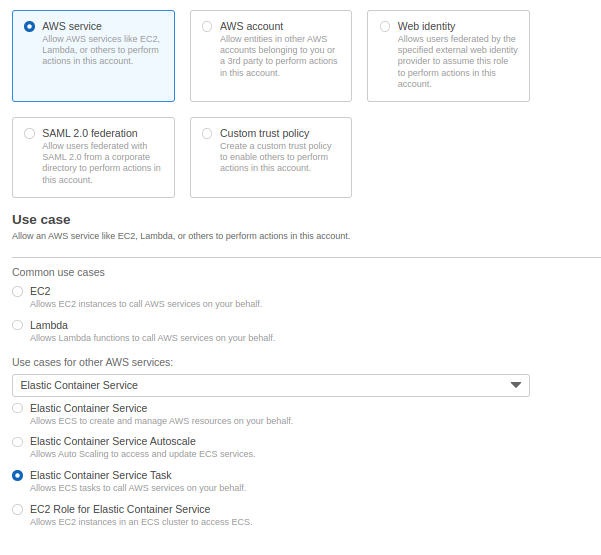

# kittens

## Create IAM Role for ECS
- IAM >> Role >> Create Role >> AWS Service > Elastic Container Service > Elastic Container Service Task >> `AmazonECSTaskExecusionRolePolicy`
    - Role Name: `ecsTaskExecutionRole`



## Create - Delete Repository using Awscli
- Create ECR repository using Awscli.
```bash
aws ecr create-repository \
--repository-name kittens/apache \
--region us-east-1
```
- Authenticate the Docker CLI to your default registry
```bash
aws ecr get-login-password --region us-east-1 | docker login --username AWS --password-stdin <account-id>.dkr.ecr.us-east-1.amazonaws.com
```
- After the build completes, tag your image so you can push the image to this repository:
```bash
docker tag kittens/apache:latest <account-id>.dkr.ecr.us-east-1.amazonaws.com/kittens/apache:latest
```
- Run the following command to push this image to your newly created AWS repository:
```bash
docker push <account-id>.dkr.ecr.us-east-1.amazonaws.com/kittens/apache:latest
```

- Delete ECR repository using Awscli.
```bash
aws ecr delete-repository \
--repository-name kittens/apache \
--force
```

## Create ECS Cluster >> Task Definition >> Service
- Create ECS Cluster 
```bash
aws ecs create-cluster <cluster-name>
```
- Create Task Definition
    - Firstly create `kittens-task.json` file and copy the following;
```json
{
    "family": "kittens-task",
    "networkMode": "awsvpc",
    "containerDefinitions": [{
    	"name": "kittens",
    	"image": "<account-id>.dkr.ecr.us-east-1.amazonaws.com/kittens/apache:latest",
    	"portMappings": [{
    		"containerPort": 80,
    		"protocol": "tcp"
   		}],
    	"essential": true
   }],
    "requiresCompatibilities": [
   		"FARGATE"
	],
	"cpu": "256",
	"memory": "512",
   		"executionRoleArn": "arn:aws:iam::<account-id>:role/ecsTaskExecutionRole"
}    
```

- Create Task Definition
```bash
aws ecs register-task-definition --cli-input-json file://kittens-task.json
```

- Create Service but don't forget to change `subnet and securityGroups`
```bash
aws ecs create-service --cluster <cluster-name> \
    --service-name <service-name> \
    --task-definition kittens-task \
    --desired-count 1 --launch-type "FARGATE" \
    --network-configuration "awsvpcConfiguration={subnets=[subnet-0a57290a9d51f677e],securityGroups=[sg-0505b0d6ccac33870],assignPublicIp=ENABLED}"
```
