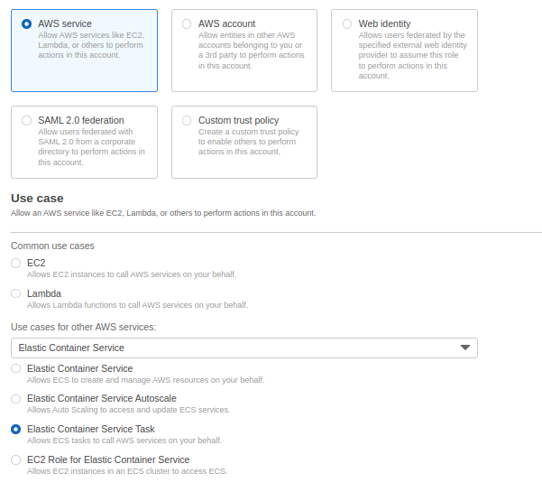

# kittens

## Part-1 Launching a Jenkins Server Configured for ECR Management
- Launch a pre-configured Jenkins Server from the terraform file running on Ubuntu 22.04, allowing SSH (port 22) and HTTP (ports 80, 8080) connections.

- Open your Jenkins dashboard and navigate to Manage `Jenkins` >> `Manage Plugins` >> `Available` tab

- Search and select `GitHub Integration, Pipeline: GitHub, Docker, Docker Pipeline plugins`, then click to `Install without restart`. Note: No need to install the other `Git plugin` which is already installed can be seen under `Installed` tab.


## Part-2 Create IAM Role for ECS
- IAM >> Role >> Create Role >> AWS Service > Elastic Container Service > Elastic Container Service Task >> `AmazonECSTaskExecusionRolePolicy`
    - Role Name: `ecsTaskExecutionRole`



## Part-3 Create ECR repo 
```groovy
stage('Create ECR Repo') {
    steps {
        echo 'Creating ECR Repo for App'
        sh """
        aws ecr create-repository \
          --repository-name ${APP_REPO_NAME} \
          --image-scanning-configuration scanOnPush=false \
          --image-tag-mutability MUTABLE \
          --region ${AWS_REGION}
        """
    }
}
```

## Part-4 Deploy to the ECS cluster
- Createa ECS cluster with a unique name with the following command.
```groovy
stage('Create ECS cluster') {
    steps {
        sh 'aws ecs create-cluster --cluster-name ${CLUSTER_NAME}-cluster'
    }
}
```

- Create a task definition file and name it as `kittens-task.json`. Don't forget the <aws-account-id> parts.

```json
{
    "family": "kittens-task",
    "networkMode": "awsvpc",
    "containerDefinitions": [{
    	"name": "kittens",
    	"image": "<aws-account-id>.dkr.ecr.us-east-1.amazonaws.com/kittens/apache:latest",
    	"portMappings": [{
    		"containerPort": 80,
    		"protocol": "tcp"
   		}],
    	"essential": true
   }],
    "requiresCompatibilities": [
   		"FARGATE"
	],
	"cpu": "256",
	"memory": "512",
   		"executionRoleArn": "arn:aws:iam::<aws-account-id>:role/ecsTaskExecutionRole"
}
```
Note: If you don't have ecsTaskExecutionRole, you can create as below.

```bash
Use case : Elastic Container Service >>> Elastic Container Service task
Policy.  : AmazonECSTaskExecutionRolePolicy
Name     : ecsTaskExecutionRole
```

- Register the task definition with the following command.
```groovy
stage('Register Task definition') {
    steps {
        sh "aws ecs register-task-definition --cli-input-json file://kittens-task.json"
    }
} 
```

- Create a service with following command. Don't forget to change `subnet` and `securityGroups`.
```groovy
stage('Create Service') {
    steps {
        sh '''aws ecs create-service --cluster <cluster-name> \\
                --service-name <service-name> \\
                --task-definition kittens-task \\
                --desired-count 1 --launch-type "FARGATE" \\
                --network-configuration "awsvpcConfiguration={subnets=[subnet-0a57290a9d51f677e],securityGroups=[sg-0505b0d6ccac33870],assignPublicIp=ENABLED}"
    '''
    }
}